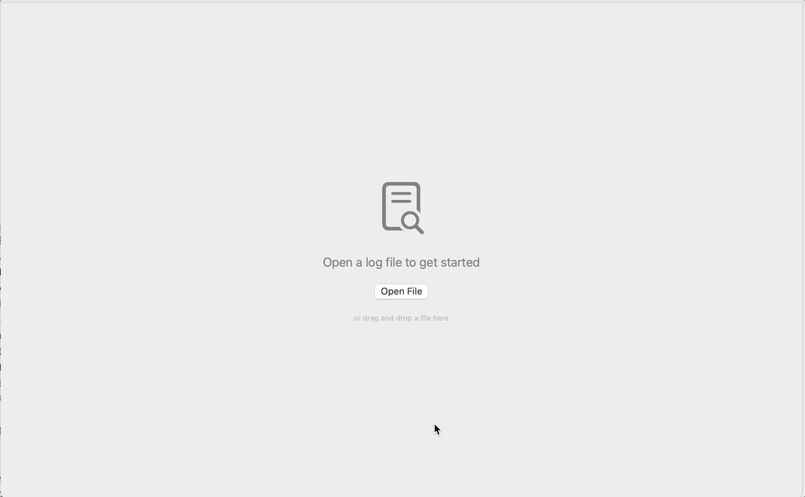
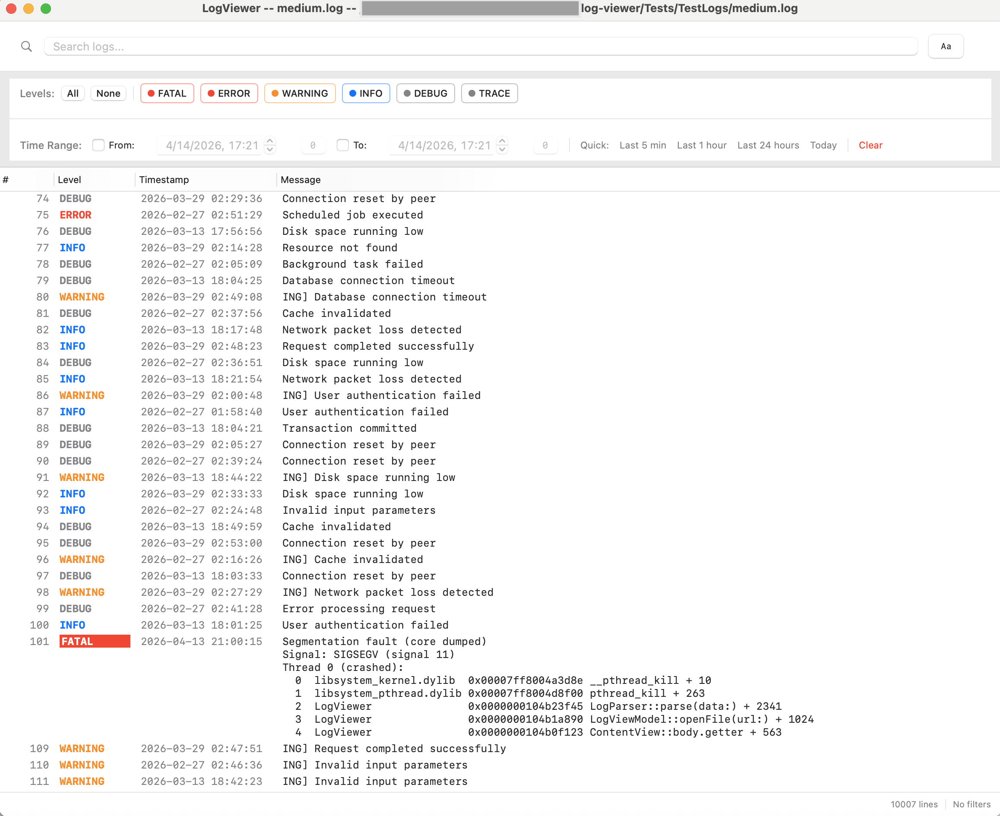
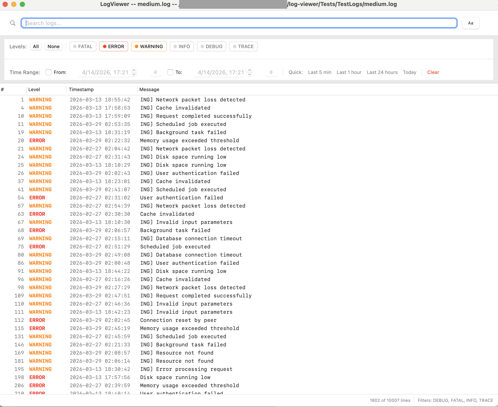
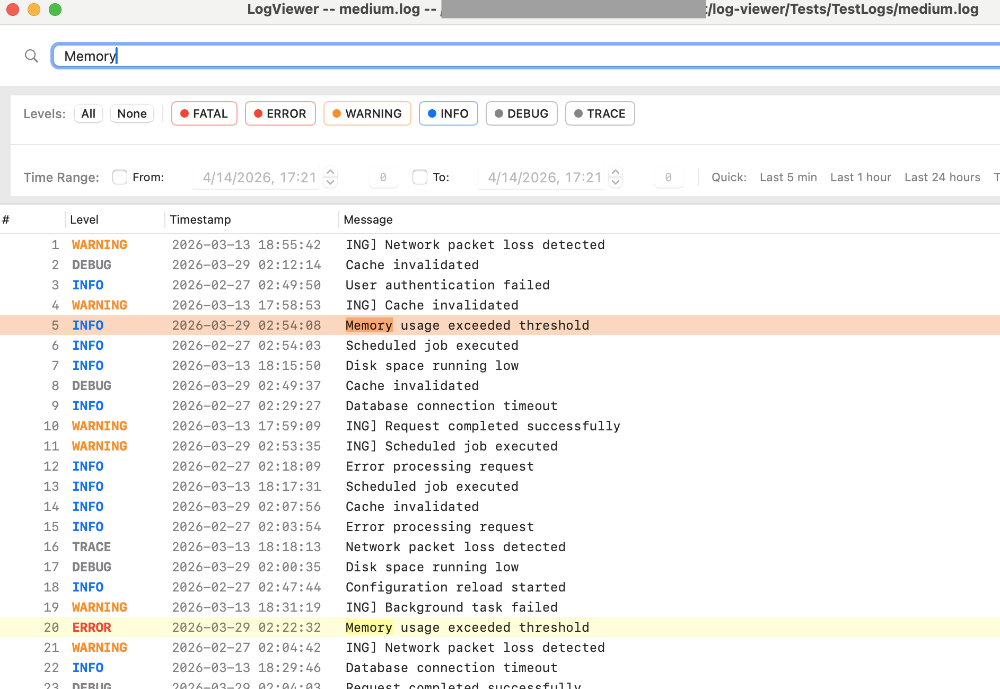

# LogViewer

A simple log file viewer, support log level color rendering, timestamp sort, keyword search, and works on large log files (tested on 500MB log files). Native macOS, built with SwiftUI and AppKit.

## Screenshots

**Quick demo**




**Main log view** — color-coded levels, timestamps, and multiline stack traces



**Log level filtering** — toggle levels to isolate errors and warnings



**Search** — jump to or filter by matching lines with highlighted results



## Features

- **High-performance rendering** with AppKit NSTableView — native cell reuse and `reloadData()` handles millions of rows smoothly. Tested with 500MB / 5M+ row log files.
- **Fast file loading** with memory-mapped I/O for large files (up to 2GB), progress bar during indexing/parsing
- **Log level filtering** - toggle FATAL, ERROR, WARNING, INFO, DEBUG, TRACE with debounced updates
- **Bracketed log level parsing** - detects both `[ERROR]` and bare `ERROR` formats
- **Search** with two modes: jump-to-match (highlight + navigate) and filter-to-match (hide non-matches), O(1) match lookups
- **Time range filtering** with seconds precision and quick presets (last 5 min, 1 hour, 24 hours, today)
- **Syntax highlighting** with pre-compiled regex, cached NSAttributedString rendering, native NSColor for AppKit
- **Multiline log entries** - stack traces and continuation lines display fully with automatic row heights
- **Auto-refresh** via file watching (detects appended content, log rotation, file deletion)
- **Incremental refresh** - reads only new bytes on file change
- **Keyboard shortcuts** - Cmd+F (search), Cmd+R (refresh), Cmd+O (open), Cmd+1-6 (toggle filters)
- **Drag and drop** file opening
- **Line numbers** in gutter
- **Multi-format timestamp parsing** - ISO 8601 (`2026-04-13T10:00:00Z`), space-separated (`2026-04-13 10:00:00`), syslog (`Apr 13 10:30:00`), Unix epoch

## Scale

| File Size | Rows | Load Time | Filtering | Scrolling |
|-----------|------|-----------|-----------|-----------|
| 10 MB | ~100k | ~2s | Instant | Smooth |
| 100 MB | ~1M | ~15s | <50ms | Smooth |
| 500 MB | ~5M | ~3 min | ~100ms | Smooth |
| 2 GB | ~20M | Theoretical max | Untested | Untested |

Load time is dominated by parsing (chunk-based, with progress indicator). Once loaded, filtering and scrolling performance is independent of file size — only visible rows are rendered.

### Generating test files

A log generator is included for stress testing:

```bash
# Generate 1M rows (~60MB) from the sample log
python3 Tests/TestLogs/generate_log.py small.log 1000000 ~/Downloads/1M.log

# Generate 5M rows (~300MB)
python3 Tests/TestLogs/generate_log.py small.log 5000000 ~/Downloads/5M.log
```

## Installation

### Option 1: Download pre-built release

Download `LogViewer.app.zip` from the [Releases](../../releases) page, unzip, and drag to `/Applications`.

> **Note:** The app is ad-hoc signed. On first launch, macOS may block it. Go to **System Settings > Privacy & Security** and click **Open Anyway**.

### Option 2: Build from source

Requires macOS 14.0+, Swift 5.9+.

```bash
# Clone and build
git clone https://github.com/emersonding/log-viewer.git
cd log-viewer
./build_app.sh
```

This builds the release binary, creates `build/LogViewer.app`, validates the bundle, and runs a smoke test.

```bash
# Install to Applications
cp -r build/LogViewer.app /Applications/

# Or run directly
open build/LogViewer.app
```

### Usage

```bash
# Open with welcome screen
open /Applications/LogViewer.app

# Open with a log file
open /Applications/LogViewer.app --args /path/to/your.log
```

## Testing

### Unit tests (~139 tests)

```bash
swift test
```

Covers: LogParser, LogViewModel, FileWatcher, Debouncer, SyntaxHighlighter, AppKitTable, Models, Performance, Rendering.

### E2E / UI tests (10 tests)

Requires the Xcode project generated by [xcodegen](https://github.com/yonaskolb/XcodeGen):

```bash
# Generate Xcode project (one-time, or after project.yml changes)
xcodegen generate

# Run UI tests from CLI
xcodebuild test -project LogViewer.xcodeproj -scheme LogViewer \
  -only-testing LogViewerUITests -destination 'platform=macOS'
```

UI tests verify: app launch, welcome screen, file loading, log level filters, search, keyboard shortcuts, refresh, screenshots, and launch performance.

### Shell-based E2E (no Xcode needed)

```bash
./build_app.sh && ./test_e2e.sh
```

Uses AppleScript automation to launch the app, send keyboard commands, and verify the process runs without crashing.

### Manual functional tests

```bash
./build_app.sh && ./test_manual.sh
```

Interactive checklist with console debug output.

## Project Layout

```
log-viewer/
├── Package.swift              # Swift Package Manager manifest
├── project.yml                # xcodegen spec (for UI test target)
├── Info.plist                 # App bundle metadata
├── build_app.sh               # Build + verify + smoke test
├── test_e2e.sh                # Shell-based E2E tests
├── test_manual.sh             # Interactive manual test checklist
├── test_sample.log            # Small 15-line test log
│
├── Sources/
│   ├── LogViewerApp.swift     # @main entry, menus, keyboard shortcuts
│   ├── Models/
│   │   ├── LogEntry.swift     # Log line data model
│   │   ├── LogLevel.swift     # FATAL..TRACE enum (via LogEntry)
│   │   ├── FilterState.swift  # Level + time range filter state
│   │   ├── SearchState.swift  # Query, mode, match tracking
│   │   └── SettingsState.swift# Font size, line wrap, auto-refresh
│   ├── Services/
│   │   ├── LogParser.swift    # Chunk-based async parser with regex
│   │   ├── FileWatcher.swift  # DispatchSource file monitoring
│   │   └── SyntaxHighlighter.swift # Pre-compiled regex, NSAttributedString cache
│   ├── Utilities/
│   │   ├── Debouncer.swift    # Actor-based debounce with Task.sleep
│   │   └── LineIndex.swift    # Byte-offset line index for O(1) access
│   ├── ViewModels/
│   │   └── LogViewModel.swift # @Observable main view model
│   └── Views/
│       ├── ContentView.swift  # Root view (welcome/loading/error/main)
│       ├── AppKitLogTableView.swift # NSTableView with cell reuse (primary)
│       ├── LogTableView.swift # SwiftUI fallback (LazyVStack, windowed)
│       ├── LogLineView.swift  # Single log line with gutter + highlight
│       ├── SearchBar.swift    # Search field + match counter + Cmd+F
│       ├── FilterBar.swift    # Level toggles + All/None
│       ├── StatusBarView.swift# Line counts + active filter indicators
│       ├── TimeRangePickerView.swift # Date pickers with seconds
│       └── SettingsView.swift # App preferences (Cmd+,)
│
├── Tests/                     # Unit tests (swift test)
│   ├── LogParserTests.swift
│   ├── LogViewModelTests.swift
│   ├── FileWatcherTests.swift
│   ├── DebouncerTests.swift
│   ├── SyntaxHighlighterTests.swift
│   ├── AppKitTableTests.swift # NSTableView cell config, multiline, colors
│   ├── ModelTests.swift
│   ├── PerformanceTests.swift
│   ├── RenderingPerformanceTests.swift
│   └── TestLogs/             # Test data files
│       ├── small.log         # 100 entries
│       ├── medium.log        # 10k entries + stack trace samples
│       ├── large.log         # 736k entries (stress test)
│       ├── multiline.log     # Multiline entries with stack traces
│       └── my_oracle.log     # 281-line realistic mock log
│
├── UITests/                   # XCUITest E2E tests (xcodebuild)
│   └── LogViewerUITests.swift
│
└── Docs/                      # Documentation
```

## Keyboard Shortcuts

| Shortcut | Action |
|----------|--------|
| Cmd+O | Open file |
| Cmd+R | Refresh file |
| Cmd+F | Focus search (Esc to de-focus) |
| Cmd+G | Next search match |
| Shift+Cmd+G | Previous search match |
| Cmd+L | Toggle line wrap |
| Cmd+1-6 | Toggle FATAL/ERROR/WARNING/INFO/DEBUG/TRACE filter |
| Cmd+, | Settings |

## License

Copyright 2026. All rights reserved.
